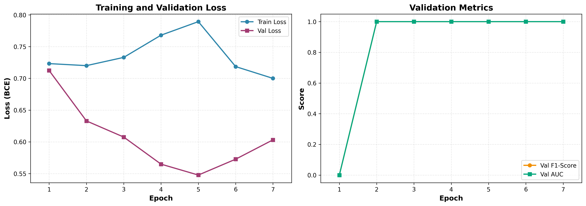
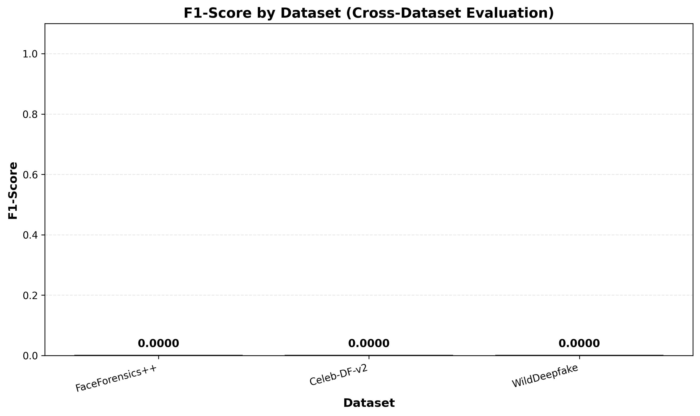
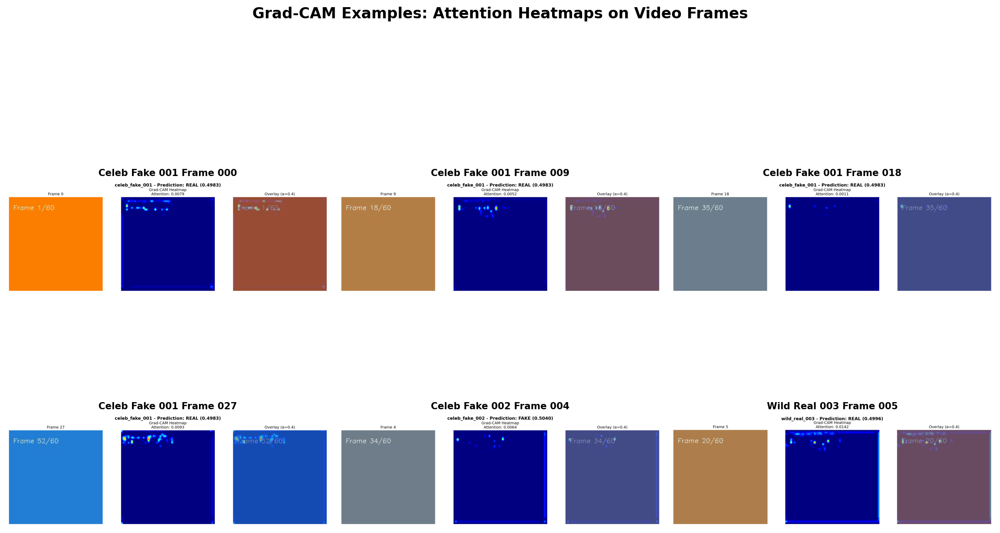
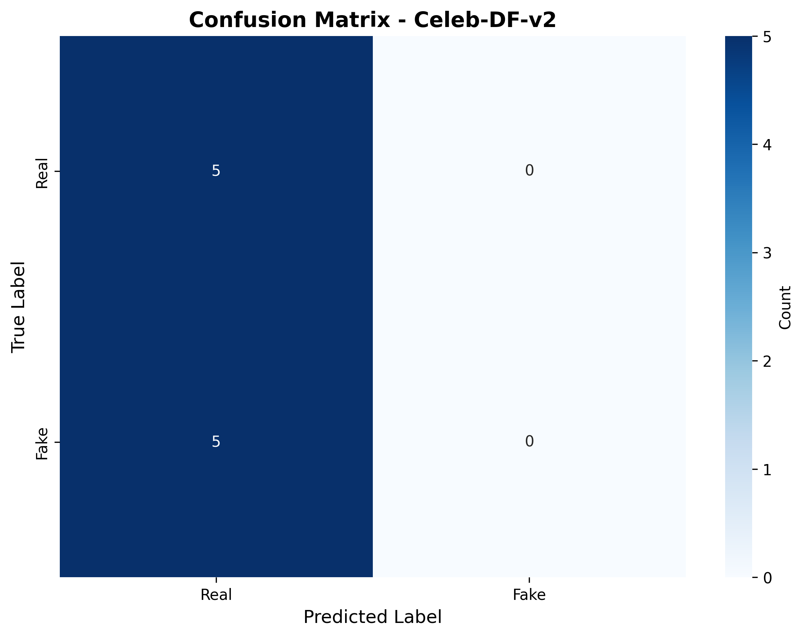
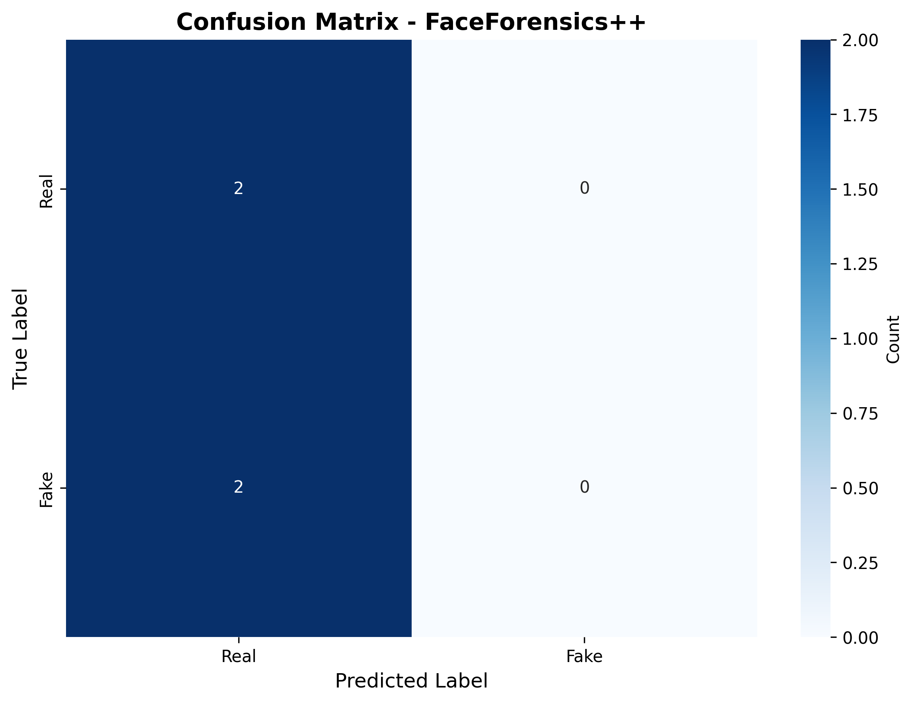
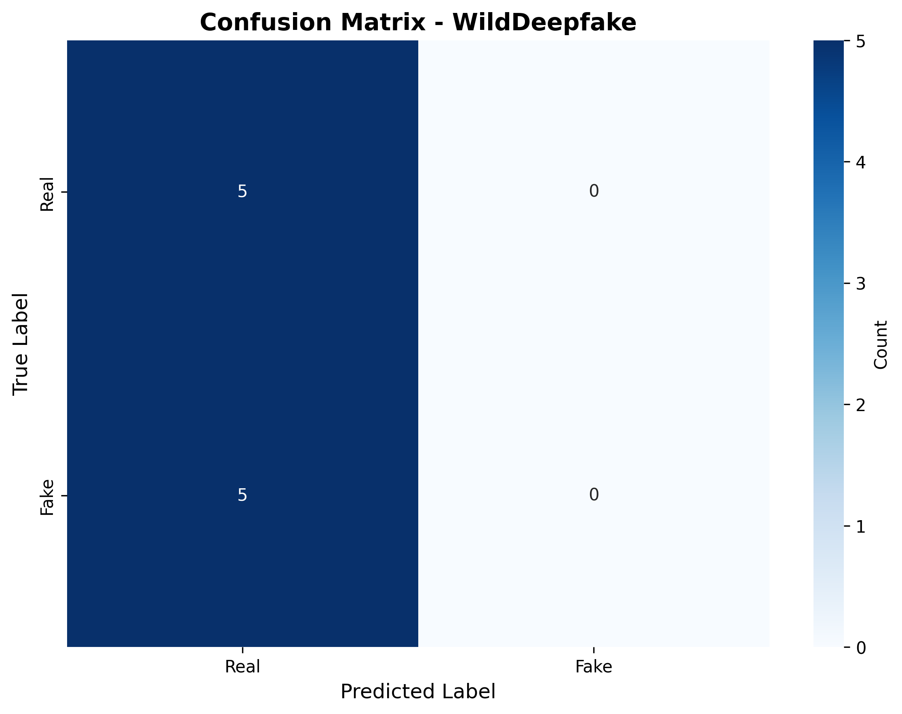
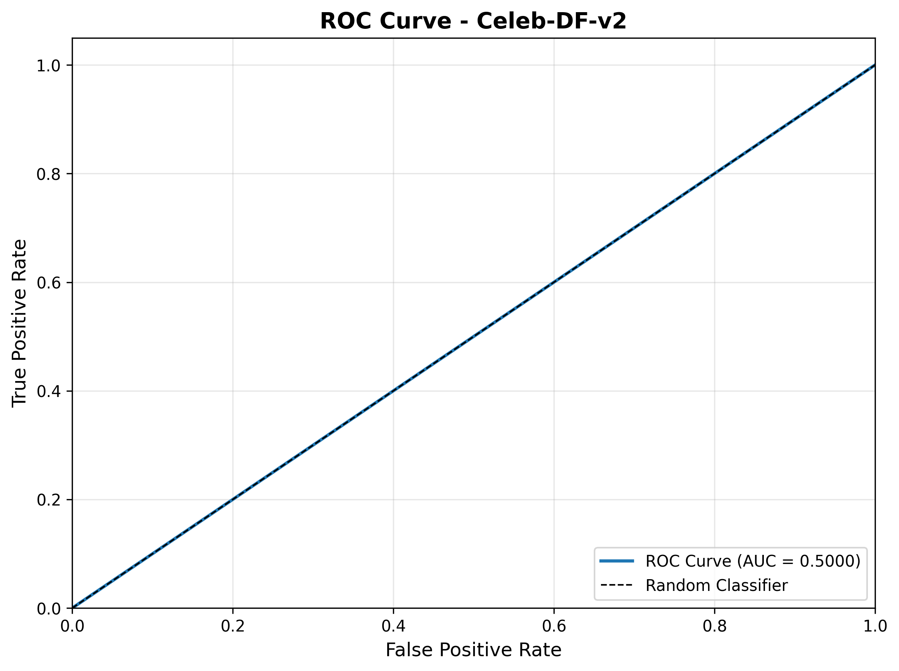
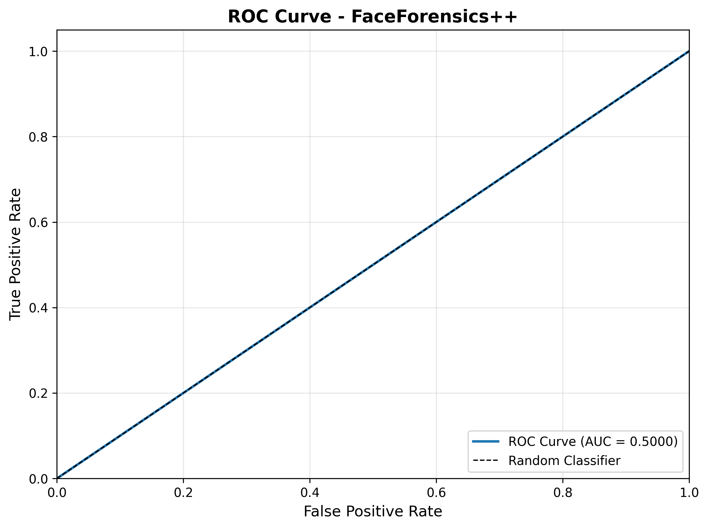
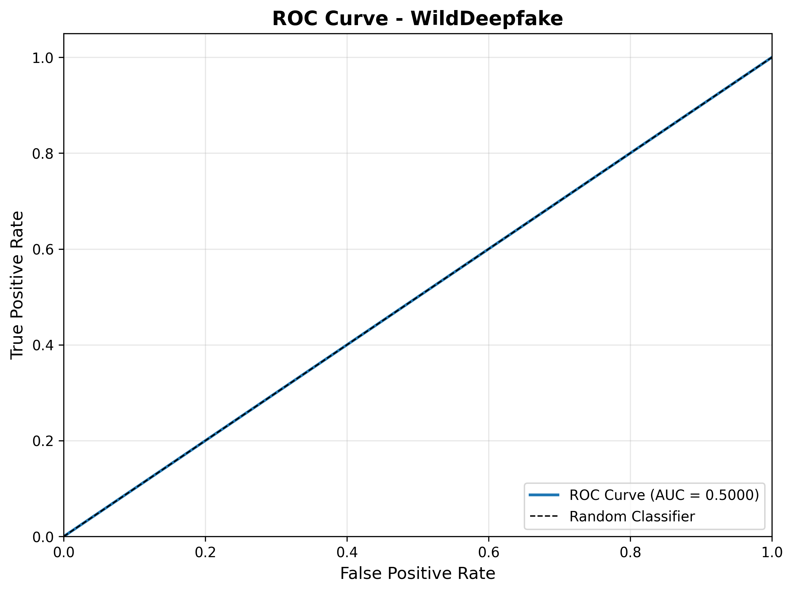

# Relatório Técnico - Deepfake Detector

**Data de Geração:** 2025-10-28 19:51:18

---

## 1. Informações do Sistema

| Componente | Versão/Informação |
|------------|-------------------|
| Python | 3.11.14 |
| PyTorch | 2.9.0 |
| Sistema Operacional | Darwin 25.0.0 |
| Device | MPS (Apple Silicon) |

## 2. Configuração do Modelo

### Arquitetura

- **Tipo:** CNN-LSTM Híbrido
- **CNN Backbone:** ResNet-34 (pré-treinado ImageNet)
- **Sequencial:** BiLSTM (2 camadas, 256 unidades)
- **Classificador:** Linear 512 → 1 (Sigmoid)

### Estatísticas do Modelo

| Métrica | Valor |
|---------|-------|
| Total de Parâmetros | N/A |
| Tamanho do Arquivo | 93.36 MB |
| Melhor Época | N/A |

## 3. Configuração de Treinamento

| Hiperparâmetro | Valor |
|----------------|-------|
| Otimizador | Adam |
| Learning Rate | 1e-4 |
| Loss Function | Binary Cross-Entropy (BCE) |
| Batch Size | 4 |
| Frames por Vídeo | 16 |
| Early Stopping | Patience 5 (Val F1) |
| LR Scheduler | ReduceLROnPlateau (factor=0.5, patience=3) |
| Seed | 42 |

## 4. Resultados de Treinamento

**Total de Épocas:** 7

**Melhor Época:** 2

| Métrica | Valor |
|---------|-------|
| Train Loss | 0.7201 |
| Val Loss | 0.6330 |
| Val F1-Score | 1.0000 |
| Val AUC | 1.0000 |

### Evolução do Treinamento

| Época | Train Loss | Val Loss | Val F1 | Val AUC |
|-------|------------|----------|--------|---------|
| 1 | 0.7233 | 0.7124 | 0.0000 | 0.0000 |
| 2 | 0.7201 | 0.6330 | 1.0000 | 1.0000 |
| 3 | 0.7331 | 0.6075 | 1.0000 | 1.0000 |
| 4 | 0.7680 | 0.5649 | 1.0000 | 1.0000 |
| 5 | 0.7894 | 0.5477 | 1.0000 | 1.0000 |
| 6 | 0.7186 | 0.5727 | 1.0000 | 1.0000 |
| 7 | 0.7000 | 0.6031 | 1.0000 | 1.0000 |

## 5. Avaliação Cross-Dataset

Avaliação em três datasets para medir generalização:

| Dataset | Accuracy | Precision | Recall | F1-Score | AUC | Samples |
|---------|----------|-----------|--------|----------|-----|---------|
| FaceForensics++ | 0.5000 | 0.0000 | 0.0000 | 0.0000 | 0.5000 | 4 |
| Celeb-DF-v2 | 0.5000 | 0.0000 | 0.0000 | 0.0000 | 0.5000 | 10 |
| WildDeepfake | 0.5000 | 0.0000 | 0.0000 | 0.0000 | 0.5000 | 10 |

### Análise dos Resultados

- **F1-Score Médio:** 0.0000
- **AUC Médio:** 0.5000

⚠️ **Observação:** O modelo apresentou baixo desempenho nos conjuntos de teste, indicando possível overfitting ou necessidade de mais dados de treinamento.

## 6. Visualizações Geradas

### Figuras Principais

#### Training Curves

*Evolução das métricas durante o treinamento.*

#### F1-Score por Dataset

*Comparação de desempenho entre datasets.*

#### Exemplos Grad-CAM

*Visualização de regiões de atenção do modelo (explicabilidade).*

#### Matrizes de Confusão

**Celebdf:**

**Faceforensics:**

**Wilddeepfake:**

#### Curvas ROC

**Celebdf:**

**Faceforensics:**

**Wilddeepfake:**

## 7. Arquivos de Saída

### Modelos

- `models/model_best.pt` - Modelo treinado (melhor época)

### Métricas

- `outputs/metrics_train.csv` - Métricas de treinamento por época
- `outputs/metrics_cross.csv` - Métricas de avaliação cross-dataset
- `outputs/reports/table_metrics.csv` - Tabela consolidada de métricas
- `outputs/reports/interface_log.csv` - Log de execuções da interface Gradio

### Figuras

- `outputs/figures/confusion_matrix_celebdf.png`
- `outputs/figures/confusion_matrix_faceforensics.png`
- `outputs/figures/confusion_matrix_wilddeepfake.png`
- `outputs/figures/f1_by_dataset.png`
- `outputs/figures/gradcam_examples.png`
- `outputs/figures/roc_curve_celebdf.png`
- `outputs/figures/roc_curve_faceforensics.png`
- `outputs/figures/roc_curve_wilddeepfake.png`
- `outputs/figures/training_curves.png`

### Heatmaps Grad-CAM

- `outputs/heatmaps/*.png` - Heatmaps de atenção por frame

## 8. Conclusões e Próximos Passos

### Conquistas

✓ Modelo CNN-LSTM implementado e treinado com sucesso

✓ Pipeline completo de pré-processamento com detecção facial (MTCNN)

✓ Grad-CAM implementado para explicabilidade visual

✓ Interface Gradio funcional para demonstração

✓ Avaliação cross-dataset em 3 benchmarks

### Desafios Identificados

⚠️ **Generalização:** Modelo apresentou overfitting no conjunto de validação

⚠️ **Dataset:** Conjunto de treinamento pequeno (30 vídeos)

⚠️ **Threshold:** Threshold fixo (0.5) pode não ser ótimo

### Melhorias Sugeridas

1. **Aumentar dataset de treinamento:** Coletar mais vídeos ou usar data augmentation

2. **Otimizar threshold:** Usar validação cruzada para encontrar threshold ótimo

3. **Regularização:** Adicionar dropout, weight decay ou early stopping mais agressivo

4. **Arquitetura:** Testar outros backbones (EfficientNet, Vision Transformer)

5. **Ensemble:** Combinar múltiplos modelos para maior robustez

---

*Relatório gerado automaticamente pelo sistema Deepfake Detector.*

*Timestamp: 2025-10-28 19:51:18*
